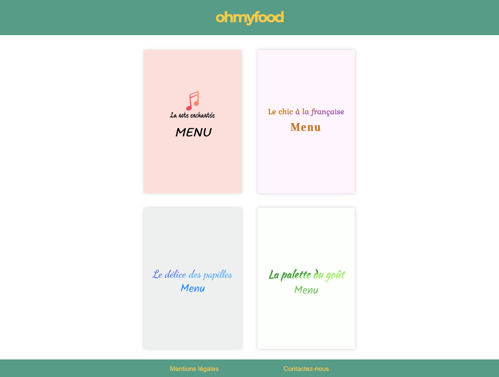

# Projet3 : Dynamisez une page web avec des animations CSS

<h3>Technologies utilisées :</h3>

● SASS 
● Animations CSS

<h3>Scénario</h3>
L'objectif est de développer un site qui répertorie les menus des plus grands restaurants new-yorkais. En plus des systèmes classiques de réservation, les clients pourront composer le menu de leur repas pour que les plats soient prêts à leur arrivée.
<h3>Remarques sur l'évaluation</h3> 
<b>Compétences évaluées</b>  

1. Évaluation globale du travail réalisé par l’étudiant (en spécifiant les critères non-validés si le projet est à retravailler) :

Adrien a réalisé un beau projet conforma à la demande.

La présentation est de qualité et le besoin est bien exprimé.

Le SAAS est bien compris et l’organisions de des fichiers du préprocesseur permettent une bonne maintenabilité.

Des correction ont cependant du être faites pour la conformité du projet:

fournir les éléments manquants dans les livrables
réduire la taille des polices  
&nbsp;&nbsp;2. Évaluation des livrables selon les critères du projet :

Le livrable n'étaient pas conformes à l'origine car il n'y avait que le support de présentation ou étaient présent les liens du site et du Github.

Adrien a corrigé cela et a fourni un livrable avec des url pour le site et le github

3. Évaluation de la présentation orale et sa conformité aux attentes :

Temps: 14mn08

La présentation orale est de qualité. Adrien a su justifier ses choix d'architecture et a su répondre aux questions

4. Évaluation des nouvelles compétences acquises par l'étudiant :

Développer chaque page d'un site web de manière cohérente et structurée: acquise. La structure du projet est définie de manière pertinente et valide.
Assurer la cohérence graphique d'un site web: acquise. Le site est conforme à la demande.
Mettre en œuvre des effets CSS graphiques avancés. acquise. Toutes les animations demandées sont présentes.  
&nbsp;&nbsp;5. Points positifs (au moins 1) :

Organisation du SASS

Choix des polices

Code bien commenté et indenté.

Excellente présentation.

6. Axes d'amélioration (au moins 1) :

Ajout d'un Burger menu.

Travailler avec des branches dans Git

CSS à la place des images pour le HR du menu
